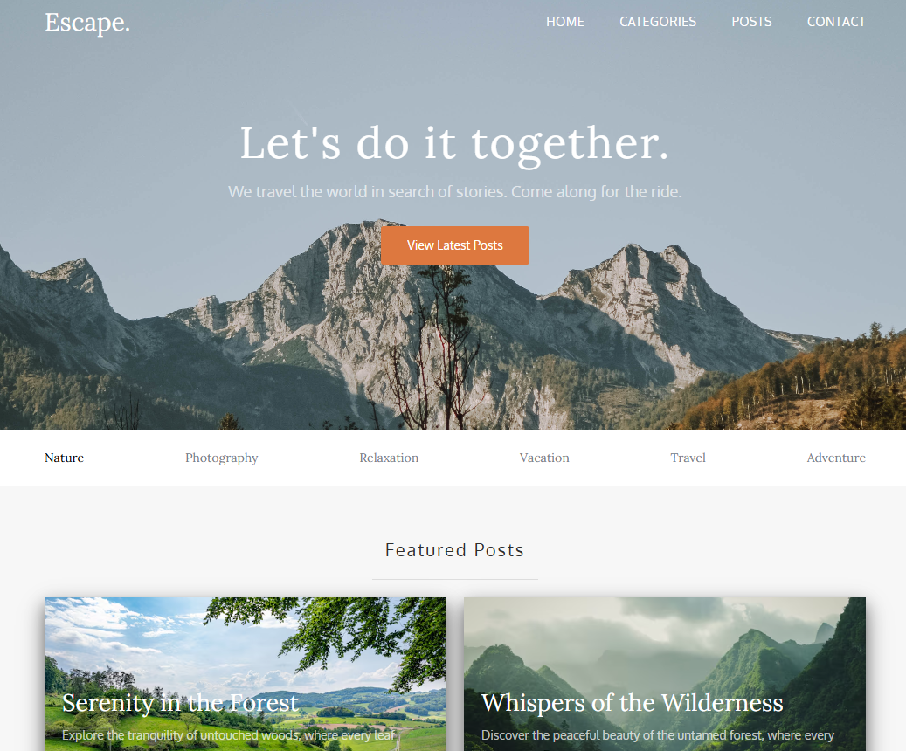

# Landing page for Escape

## Description

Developed a responsive one page website using HTML, CSS, JS, REACT. The site is adapted for various devices, including mobile and tablets. The site was developed using mobile first methodology.
Smooth transitions, interactive elements, smooth navigation were implemented. The project was implemented according to the BEM methodology, providing clean and structured code (for the convenience of further support by developers). The layout is cross-browser, tested in popular browsers.

Technologies that have been used

- HTML5
- CSS3
- JS
- SASS
- VITE
- GIT
- FIGMA
- REACT

## Instructions for working with the project

1. Cloning a repository. You need to write `git clone https://github.com/boikoua/escape_landing` in terminal.

2. Go to the project folder `cd escape_landing`.

3. Check the node version. The version of node should be `v20.x.x`. To do this, type the command `node -v` in the terminal.

4. Install dependencies. To do this, enter the `npm install` command.

5. Run the project. To do this, enter the `npm run dev` command.
   After that the project will be available to you at `http://http://localhost:5173/`.

## View project and design

> Link to the project
> [DEMO LINK](https://boikoua.github.io/escape_landing/).

## Preview

